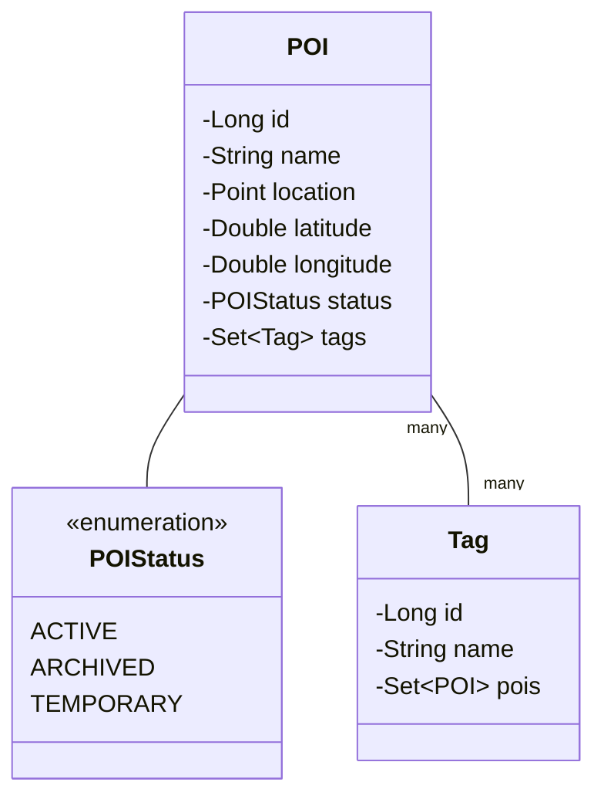
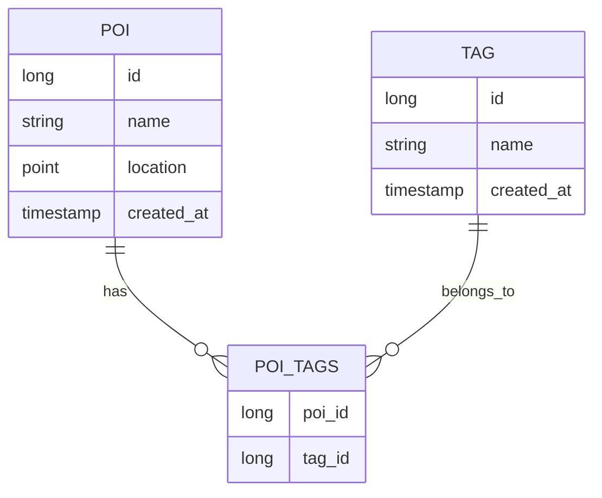

# Understanding the Entity Model Implementation in GeoPin

## 1. Introduction
In Spring Boot applications, entities are Java classes that represent tables in our database. Each instance of an entity class becomes a row in its corresponding database table. Think of entities as blueprints that tell Spring Boot how to store and manage our application's data.

Our model package contains three key components:


## 2. Project Dependencies
Our implementation required specific additions to the pom.xml file to handle geographical data and entity management:

### Spring Boot Core Dependencies
```xml
<dependency>
    <groupId>org.springframework.boot</groupId>
    <artifactId>spring-boot-starter-data-jpa</artifactId>
</dependency>
<dependency>
    <groupId>org.postgresql</groupId>
    <artifactId>postgresql</artifactId>
    <scope>runtime</scope>
</dependency>
```
These dependencies provide:
- JPA (Java Persistence API) for database operations
- PostgreSQL driver for database connectivity

### Geographical Data Dependencies
```xml
<dependency>
    <groupId>org.hibernate.orm</groupId>
    <artifactId>hibernate-spatial</artifactId>
    <version>6.4.1.Final</version>
</dependency>
<dependency>
    <groupId>org.locationtech.jts</groupId>
    <artifactId>jts-core</artifactId>
    <version>1.19.0</version>
</dependency>
```
These additions enable:
- Storage and manipulation of geographical data using PostGIS
- Creation and management of spatial objects like points
- Support for geographical queries

## 3. Entity Implementation

### 3.1 POI (Point of Interest) Entity
The POI class represents locations that users want to remember. Think of it as a digital pushpin on a map, with all the information needed to describe and find that location later.

```java
@Entity
@Table(name = "pois")
public class POI {
    @Id
    @GeneratedValue(strategy = GenerationType.IDENTITY)
    private Long id;

    @Column(nullable = false)
    private String name;
    
    // ... other fields
}
```

Key components:
1. **Basic Information**
   - id: Unique identifier for each POI
   - name: Human-readable name of the location
   - description: Detailed information about the location

2. **Geographic Data**
   - latitude & longitude: Precise coordinates
   - location: PostGIS Point object for advanced geographical queries
   ```java
   @Column(columnDefinition = "geometry(Point,4326)")
   private Point location;
   ```

3. **Metadata**
   - createdAt: When the POI was first saved
   - updatedAt: Last modification timestamp
   - status: Current state (ACTIVE, ARCHIVED, TEMPORARY)

4. **Relationships**
   ```java
   @ManyToMany(fetch = FetchType.LAZY)
   @JoinTable(
       name = "poi_tags",
       joinColumns = @JoinColumn(name = "poi_id"),
       inverseJoinColumns = @JoinColumn(name = "tag_id")
   )
   private Set<Tag> tags = new HashSet<>();
   ```

Example usage:
```java
POI restaurant = new POI("Favorite Pizza Place", 40.7128, -74.0060);
restaurant.setDescription("Best margherita in town");
restaurant.setStatus(POIStatus.ACTIVE);
```

### 3.2 Tag Entity
Tags provide a flexible way to categorize POIs. They work similarly to hashtags on social media, allowing users to group and find related locations.

```java
@Entity
@Table(name = "tags")
public class Tag {
    @Id
    @GeneratedValue(strategy = GenerationType.IDENTITY)
    private Long id;

    @Column(nullable = false, unique = true)
    private String name;
    
    @ManyToMany(mappedBy = "tags")
    private Set<POI> pois = new HashSet<>();
}
```

Example usage:
```java
Tag foodTag = new Tag("restaurant");
Tag italianTag = new Tag("italian");

restaurant.addTag(foodTag);
restaurant.addTag(italianTag);
```

### 3.3 POIStatus Enum
```java
public enum POIStatus {
    ACTIVE,    // Normal, visible POI
    ARCHIVED,  // Hidden but preserved
    TEMPORARY  // For temporary locations or events
}
```

## 4. Entity Relationships
The relationship between POI and Tag is Many-to-Many, meaning:
- Each POI can have multiple tags
- Each tag can be applied to multiple POIs



## 5. Design Decisions

### Using Set Instead of List
We chose to use Set for the tags collection because:
- It prevents duplicate tags on a POI
- Order doesn't matter for tags
- Better performance for membership operations

### Geographic Data Implementation
We store location data in two ways:
1. Separate latitude and longitude fields for easy access and validation
2. PostGIS Point object for spatial queries

This dual approach provides:
- Simple coordinate access when needed
- Powerful spatial query capabilities
- Data consistency through automatic synchronization

### Timestamp Management
We use Hibernate annotations to automatically manage timestamps:
```java
@CreationTimestamp
@Column(name = "created_at", nullable = false, updatable = false)
private LocalDateTime createdAt;

@UpdateTimestamp
@Column(name = "updated_at", nullable = false)
private LocalDateTime updatedAt;
```

## 6. Real-World Usage Examples

### Creating a New POI
```java
// Creating a restaurant POI
POI restaurant = new POI("Pizza Palace", 40.7128, -74.0060);
restaurant.setDescription("Authentic Neapolitan pizza");
restaurant.setSourceReference("Friend's recommendation");

// Adding tags
Tag italianTag = new Tag("italian");
Tag restaurantTag = new Tag("restaurant");
Tag favoriteTag = new Tag("favorite");

restaurant.addTag(italianTag);
restaurant.addTag(restaurantTag);
restaurant.addTag(favoriteTag);
```

### Managing POI Status
```java
// For a temporary pop-up restaurant
POI popupRestaurant = new POI("Summer Food Festival", 40.7829, -73.9654);
popupRestaurant.setStatus(POIStatus.TEMPORARY);

// Later, when the event is over
popupRestaurant.setStatus(POIStatus.ARCHIVED);
```