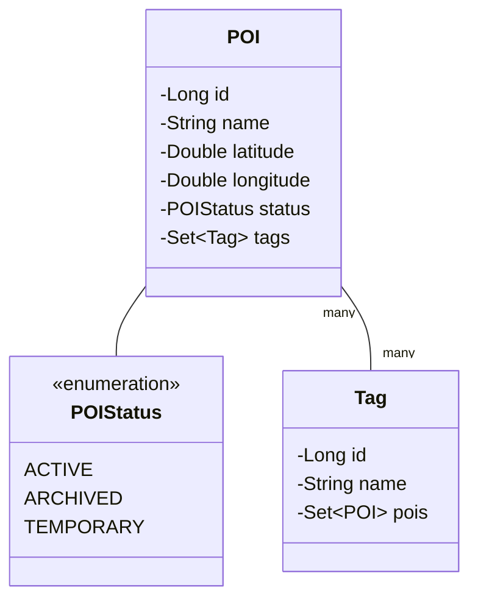

# Understanding the Entity Model Implementation in GeoPin

## Introduction to Entity Design

When developing a Spring Boot application like GeoPin, entities serve as the bridge between our Java code and the database. Think of entities as blueprints that tell Spring Boot how to store and manage our application's data. Each entity class represents a table in our database, and each instance of that class becomes a row in that table.

Our model package contains three essential components that work together to manage location data effectively:



This diagram shows how our entities relate to each other. A POI (Point of Interest) can have multiple tags, and each tag can be associated with multiple POIs. The POIStatus enum helps us track whether a location is currently active, archived, or temporary.

## Project Dependencies

One of the benefits of our simplified architecture is that we only need standard Spring Boot dependencies. Here's what we use and why:

```xml
<dependency>
    <groupId>org.springframework.boot</groupId>
    <artifactId>spring-boot-starter-data-jpa</artifactId>
</dependency>
```
This dependency provides JPA (Java Persistence API) functionality, which handles all our database operations. It's like a translator that converts our Java objects into database records and back.

```xml
<dependency>
    <groupId>org.postgresql</groupId>
    <artifactId>postgresql</artifactId>
    <scope>runtime</scope>
</dependency>
```
This gives us the ability to connect to PostgreSQL databases. We use PostgreSQL because it's reliable and widely supported, though our simplified design would work with any relational database.

```xml
<dependency>
    <groupId>com.h2database</groupId>
    <artifactId>h2</artifactId>
    <scope>test</scope>
</dependency>
```
H2 is an in-memory database that we use for testing. It's fast, doesn't require installation, and perfectly supports our simplified coordinate storage approach.

## POI (Point of Interest) Entity

The POI class is the heart of our application. Think of it as a digital pushpin on a map, containing all the information we need about a specific location. Here's how we've implemented it:

```java
@Entity
@Table(name = "pois")
public class POI {
    @Id
    @GeneratedValue(strategy = GenerationType.IDENTITY)
    private Long id;

    @Column(nullable = false)
    private String name;

    @Column(nullable = false)
    private Double latitude;

    @Column(nullable = false)
    private Double longitude;
    
    @Column(columnDefinition = "text")
    private String description;
    
    @Enumerated(EnumType.STRING)
    @Column(nullable = false)
    private POIStatus status = POIStatus.ACTIVE;
    
    @CreationTimestamp
    @Column(name = "created_at", nullable = false, updatable = false)
    private LocalDateTime createdAt;

    @UpdateTimestamp
    @Column(name = "updated_at", nullable = false)
    private LocalDateTime updatedAt;
}
```

Let's break down each part of this entity:

### Basic Information
The name and description fields help users identify and understand each location. The name is required (nullable = false), while the description is optional and can hold longer text (columnDefinition = "text").

### Geographic Coordinates
We store locations using two Double fields: latitude and longitude. This approach is:
- Intuitive: Coordinates are stored exactly as they appear on maps
- Universal: These coordinates use the WGS84 system, the same system used by GPS and Google Maps
- Simple: No special database extensions needed
- Precise: Double precision is more than adequate for location bookmarking

The valid ranges are:
- Latitude: -90 to +90 degrees (negative for southern hemisphere)
- Longitude: -180 to +180 degrees (negative for western hemisphere)

### Status and Timestamps
We track each POI's status using an enum (ACTIVE, ARCHIVED, or TEMPORARY) and automatically record when it was created and last updated. The @CreationTimestamp and @UpdateTimestamp annotations handle these timestamps for us, ensuring we always know when changes happen.

### Relationships
POIs can have multiple tags, which we manage through a many-to-many relationship:

```java
@ManyToMany(fetch = FetchType.LAZY)
@JoinTable(
    name = "poi_tags",
    joinColumns = @JoinColumn(name = "poi_id"),
    inverseJoinColumns = @JoinColumn(name = "tag_id")
)
private Set<Tag> tags = new HashSet<>();
```

This creates an intermediate table (poi_tags) that connects POIs with their tags. We use FetchType.LAZY to improve performance by only loading tags when they're specifically requested.

## Tag Entity

Tags help users organize and find their locations. Our Tag implementation is straightforward:

```java
@Entity
@Table(name = "tags")
public class Tag {
    @Id
    @GeneratedValue(strategy = GenerationType.IDENTITY)
    private Long id;

    @Column(nullable = false, unique = true)
    private String name;
    
    @ManyToMany(mappedBy = "tags")
    private Set<POI> pois = new HashSet<>();
}
```

Note the unique = true constraint on the name field – this ensures we don't have duplicate tags like "restaurant" and "Restaurant".

## POIStatus Enum

Our status enum helps manage the lifecycle of locations:

```java
public enum POIStatus {
    ACTIVE,    // Normal, visible POI
    ARCHIVED,  // Hidden but preserved
    TEMPORARY  // For temporary locations or events
}
```

This simple enum gives us powerful control over how locations appear in the application.

## Design Decisions and Their Benefits

Several key decisions shaped our entity design:

### Using Standard Double Fields
We chose to store coordinates as simple Double fields because:
- It's easy to understand and maintain
- Works with any database without special extensions
- Provides more than enough precision for our needs
- Makes testing simpler with in-memory databases
- Allows straightforward validation and processing

### Choosing Sets for Collections
We use HashSet for both the POI-Tag relationship and Tag-POI relationship because:
- Sets prevent duplicate entries automatically
- Order doesn't matter for tags
- HashSet provides fast lookup performance
- Memory usage is optimized for our use case

### Automatic Timestamp Management
By using @CreationTimestamp and @UpdateTimestamp, we ensure:
- Creation times are set automatically and can't be changed
- Update times are always current
- We have a reliable audit trail of changes
- Developers don't need to manage these fields manually

## Real-World Usage Examples

Here's how to use these entities in practice:

### Creating a New POI
```java
// Create a new restaurant POI
POI restaurant = new POI();
restaurant.setName("Joe's Pizza");
restaurant.setLatitude(40.7128);  // New York City coordinates
restaurant.setLongitude(-74.0060);
restaurant.setDescription("Best NY style pizza in the city");

// Add some tags
Tag foodTag = new Tag("restaurant");
Tag pizzaTag = new Tag("pizza");
restaurant.addTag(foodTag);
restaurant.addTag(pizzaTag);
```

### Managing POI Status
```java
// For a pop-up food truck
POI foodTruck = new POI();
foodTruck.setName("Taco Tuesday Truck");
foodTruck.setStatus(POIStatus.TEMPORARY);

// When the food truck stops operating
foodTruck.setStatus(POIStatus.ARCHIVED);
```

## Best Practices

When working with these entities, keep these guidelines in mind:

1. Always validate coordinates before saving:
   - Latitude must be between -90 and 90
   - Longitude must be between -180 and 180

2. Use the addTag() and removeTag() methods instead of directly modifying the tags Set to maintain proper bidirectional relationships.

3. Consider the status when querying POIs - you might want to filter out ARCHIVED locations by default.

4. Remember that tags are case-sensitive - consider converting to lowercase before saving to maintain consistency.

5. Use meaningful names and descriptions to make locations easy to find later.

These entities form the foundation of GeoPin, providing a simple but powerful way to store and manage location data. Their design reflects our commitment to simplicity and maintainability while meeting all our functional requirements.