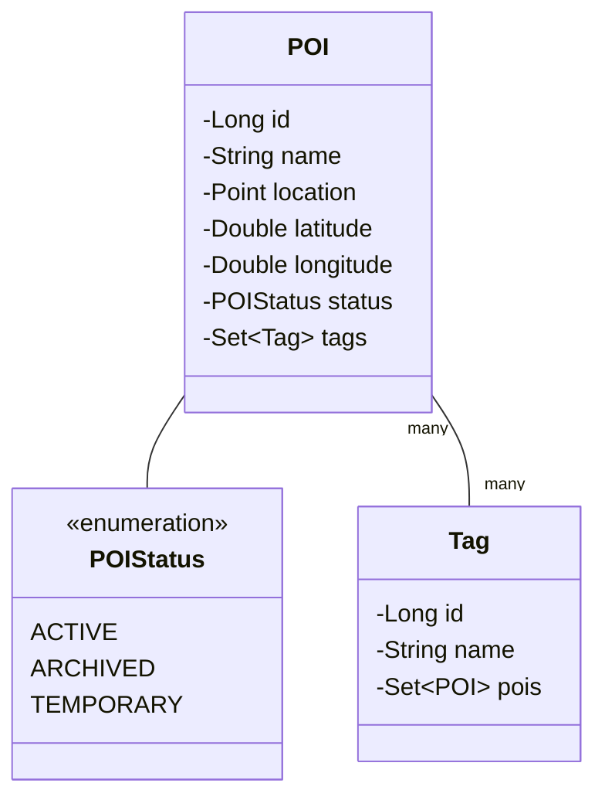
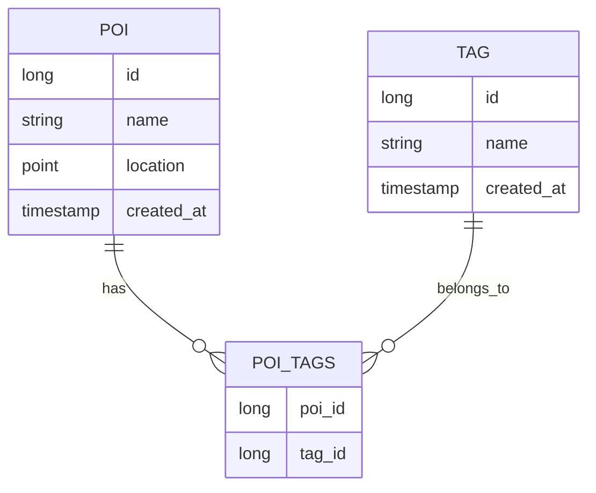

# Understanding the Entity Model Implementation in GeoPin

## 1. Introduction
In Spring Boot applications, entities are Java classes that represent tables in our database. Each instance of an entity class becomes a row in its corresponding database table. Think of entities as blueprints that tell Spring Boot how to store and manage our application's data.

Our model package contains three key components:


## 2. Project Dependencies
Our implementation required specific additions to the pom.xml file to handle geographical data and entity management:

### Spring Boot Core Dependencies
```xml
<dependency>
    <groupId>org.springframework.boot</groupId>
    <artifactId>spring-boot-starter-data-jpa</artifactId>
</dependency>
<dependency>
    <groupId>org.postgresql</groupId>
    <artifactId>postgresql</artifactId>
    <scope>runtime</scope>
</dependency>
```
These dependencies provide:
- JPA (Java Persistence API) for database operations
- PostgreSQL driver for database connectivity

### Geographical Data Dependencies
```xml
<dependency>
    <groupId>org.hibernate.orm</groupId>
    <artifactId>hibernate-spatial</artifactId>
    <version>6.4.1.Final</version>
</dependency>
<dependency>
    <groupId>org.locationtech.jts</groupId>
    <artifactId>jts-core</artifactId>
    <version>1.19.0</version>
</dependency>
```
These additions enable:
- Storage and manipulation of geographical data using PostGIS
- Creation and management of spatial objects like points
- Support for geographical queries

## 3. Entity Implementation

### 3.1 POI (Point of Interest) Entity
The POI class represents locations that users want to remember. Think of it as a digital pushpin on a map, with all the information needed to describe and find that location later.

```java
@Entity
@Table(name = "pois")
public class POI {
    @Id
    @GeneratedValue(strategy = GenerationType.IDENTITY)
    private Long id;

    @Column(nullable = false)
    private String name;
    
    // ... other fields
}
```

Key components:
1. **Basic Information**
   - id: Unique identifier for each POI
   - name: Human-readable name of the location
   - description: Detailed information about the location

2. **Geographic Data**
   - latitude & longitude: Precise coordinates
   - location: PostGIS Point object for advanced geographical queries
   ```java
   @Column(columnDefinition = "geometry(Point,4326)")
   private Point location;
   ```

3. **Metadata**
   - createdAt: When the POI was first saved
   - updatedAt: Last modification timestamp
   - status: Current state (ACTIVE, ARCHIVED, TEMPORARY)

4. **Relationships**
   ```java
   @ManyToMany(fetch = FetchType.LAZY)
   @JoinTable(
       name = "poi_tags",
       joinColumns = @JoinColumn(name = "poi_id"),
       inverseJoinColumns = @JoinColumn(name = "tag_id")
   )
   private Set<Tag> tags = new HashSet<>();
   ```

Example usage:
```java
POI restaurant = new POI("Favorite Pizza Place", 40.7128, -74.0060);
restaurant.setDescription("Best margherita in town");
restaurant.setStatus(POIStatus.ACTIVE);
```

### 3.2 Tag Entity
Tags provide a flexible way to categorize POIs. They work similarly to hashtags on social media, allowing users to group and find related locations.

```java
@Entity
@Table(name = "tags")
public class Tag {
    @Id
    @GeneratedValue(strategy = GenerationType.IDENTITY)
    private Long id;

    @Column(nullable = false, unique = true)
    private String name;
    
    @ManyToMany(mappedBy = "tags")
    private Set<POI> pois = new HashSet<>();
}
```

Example usage:
```java
Tag foodTag = new Tag("restaurant");
Tag italianTag = new Tag("italian");

restaurant.addTag(foodTag);
restaurant.addTag(italianTag);
```

### 3.3 POIStatus Enum
```java
public enum POIStatus {
    ACTIVE,    // Normal, visible POI
    ARCHIVED,  // Hidden but preserved
    TEMPORARY  // For temporary locations or events
}
```

## 4. Entity Relationships
The relationship between POI and Tag is Many-to-Many, meaning:
- Each POI can have multiple tags
- Each tag can be applied to multiple POIs



## 5. Design Decisions

### Using Set Instead of List
We chose to use Set for the tags collection because:
- It prevents duplicate tags on a POI
- Order doesn't matter for tags
- Better performance for membership operations

### Geographic Data Implementation
We store location data in two ways:
1. Separate latitude and longitude fields for easy access and validation
2. PostGIS Point object for spatial queries

This dual approach provides:
- Simple coordinate access when needed
- Powerful spatial query capabilities
- Data consistency through automatic synchronization

### Timestamp Management
We use Hibernate annotations to automatically manage timestamps:
```java
@CreationTimestamp
@Column(name = "created_at", nullable = false, updatable = false)
private LocalDateTime createdAt;

@UpdateTimestamp
@Column(name = "updated_at", nullable = false)
private LocalDateTime updatedAt;
```

## 6. Real-World Usage Examples

### Creating a New POI
```java
// Creating a restaurant POI
POI restaurant = new POI("Pizza Palace", 40.7128, -74.0060);
restaurant.setDescription("Authentic Neapolitan pizza");
restaurant.setSourceReference("Friend's recommendation");

// Adding tags
Tag italianTag = new Tag("italian");
Tag restaurantTag = new Tag("restaurant");
Tag favoriteTag = new Tag("favorite");

restaurant.addTag(italianTag);
restaurant.addTag(restaurantTag);
restaurant.addTag(favoriteTag);
```

### Managing POI Status
```java
// For a temporary pop-up restaurant
POI popupRestaurant = new POI("Summer Food Festival", 40.7829, -73.9654);
popupRestaurant.setStatus(POIStatus.TEMPORARY);

// Later, when the event is over
popupRestaurant.setStatus(POIStatus.ARCHIVED);
```

## 7. Repository Layer Implementation

### 7.1 Understanding the Repository Pattern
The repository pattern acts as a bridge between our domain models (POI and Tag entities) and the database. Think of repositories as specialized librarians who know exactly how to store, find, and organize different types of books. In our case, they handle Points of Interest and Tags, including complex spatial queries.

When we extend JpaRepository, Spring Boot automatically provides us with standard database operations like save, delete, and findById. However, for our location-based application, we need more specialized queries, particularly for finding POIs based on geographic location and tags.

### 7.2 POI Repository Implementation

Our POIRepository interface extends JpaRepository to handle POI entities:

```java
@Repository
public interface POIRepository extends JpaRepository<POI, Long> {
    // First type parameter (POI) tells Spring this repository manages POI entities
    // Second type parameter (Long) specifies the type of the entity's ID field
}
```

#### 7.2.1 Spatial Queries
We implemented two main spatial query methods to support common location-based search scenarios:

1. Finding POIs Within a Distance:
```java
@Query(value = "SELECT p.* FROM poi p WHERE ST_DWithin(" +
       "p.location, :location, :distanceInMeters, true)", 
       nativeQuery = true)
List<POI> findPOIsWithinDistance(
    @Param("location") Point location, 
    @Param("distanceInMeters") double distanceInMeters
);
```

Let's break down this query:
- `ST_DWithin` is a PostGIS function that checks if two geometries are within a specified distance
- The `true` parameter tells PostGIS to use spherical distance calculation, which is more accurate for geographic coordinates
- We use `@Query` with `nativeQuery = true` because we need to use PostGIS-specific SQL functions
- The method returns a List<POI> containing all POIs within the specified radius

Real-world example:
```java
// Finding all restaurants within 500 meters of my current location
Point myLocation = geometryFactory.createPoint(new Coordinate(-73.9857, 40.7484));
List<POI> nearbyPOIs = poiRepository.findPOIsWithinDistance(myLocation, 500);
```

2. Finding POIs Within a Bounding Box:
```java
@Query(value = "SELECT p.* FROM poi p WHERE ST_Within(" +
       "p.location, ST_MakeEnvelope(" +
       "ST_X(:southWest), ST_Y(:southWest), " +
       "ST_X(:northEast), ST_Y(:northEast), 4326))",
       nativeQuery = true)
List<POI> findPOIsWithinBoundingBox(
    @Param("southWest") Point southWest,
    @Param("northEast") Point northEast
);
```

Understanding the components:
- `ST_Within` checks if a geometry is completely within another geometry
- `ST_MakeEnvelope` creates a rectangular area from two corner points
- `4326` is the SRID (Spatial Reference System Identifier) for WGS84, the standard coordinate system used by GPS
- The method returns POIs that fall within the rectangular area

Real-world example:
```java
// Finding all POIs visible in the current map view
Point swCorner = geometryFactory.createPoint(new Coordinate(-74.0060, 40.7128));
Point neCorner = geometryFactory.createPoint(new Coordinate(-73.9350, 40.7818));
List<POI> poisInMapView = poiRepository.findPOIsWithinBoundingBox(swCorner, neCorner);
```

### 7.3 Tag Repository Implementation

The TagRepository interface handles operations related to Tags and their relationships with POIs:

```java
@Repository
public interface TagRepository extends JpaRepository<Tag, Long> {
    // Basic CRUD operations inherited from JpaRepository
}
```

#### 7.3.1 Custom Tag Queries
We implemented a method to find POIs by tag name:

```java
@Query("SELECT DISTINCT p FROM POI p JOIN p.tags t WHERE t.name = :tagName")
List<POI> findPOIsByTagName(@Param("tagName") String tagName);
```

Understanding the query:
- `SELECT DISTINCT` prevents duplicate POIs in results
- `JOIN p.tags t` uses the JPA relationship we defined in our entities
- The JPQL syntax is different from our spatial queries because it doesn't need PostGIS functions

Real-world example:
```java
// Finding all Italian restaurants
List<POI> italianRestaurants = tagRepository.findPOIsByTagName("italian");

// Finding all temporary events
List<POI> temporaryEvents = tagRepository.findPOIsByTagName("temporary");
```

### 7.4 Understanding Query Performance

Our repository implementation considers several performance aspects:

1. Spatial Indexing:
   - PostGIS automatically creates spatial indexes on geometry columns
   - `ST_DWithin` and `ST_Within` are optimized to use these indexes
   - This makes our spatial queries efficient even with many POIs

2. Query Optimization:
   - Using `ST_DWithin` instead of calculating distances manually
   - Leveraging PostGIS's built-in functions for complex geometric operations
   - Using DISTINCT to prevent duplicate results in tag queries

3. Memory Efficiency:
   - Returning Lists instead of Sets when order might matter
   - Using lazy loading for tag relationships to prevent unnecessary data fetching

### 7.5 Future Considerations

As the application grows, we might want to add:
1. Pagination support for queries returning large result sets
2. More complex spatial queries (like finding POIs along a route)
3. Full-text search capabilities for POI names and descriptions
4. Caching frequently accessed results
5. Additional tag-related queries (like finding popular tags in an area)

### 7.6 Testing Strategy (Coming Soon)

The next step in our implementation will be creating comprehensive tests for our repository layer, including:
1. Unit tests for basic CRUD operations
2. Integration tests for spatial queries
3. Performance tests for large datasets
4. Edge case handling for invalid coordinates or empty results