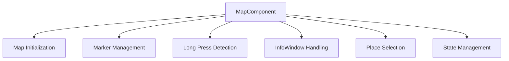
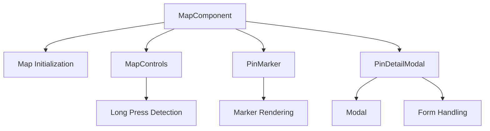
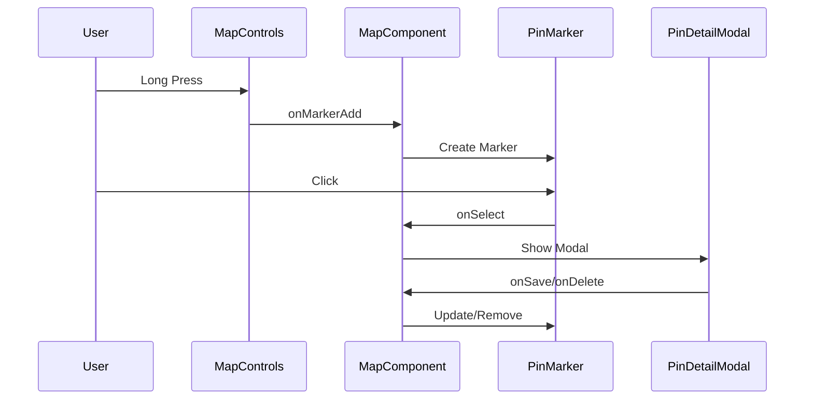

# MapComponent Restructuring Documentation

## Overview
This document details the restructuring of the MapComponent, originally a monolithic component handling all map-related functionality, into a more modular and maintainable architecture.

## Original Structure
Initially, MapComponent was responsible for:
- Google Maps initialization
- Marker management
- Long-press detection
- InfoWindow handling
- Place selection
- State management for all features



## New Architecture
We separated concerns into specialized components:



### Component Responsibilities

1. **MapComponent (Orchestrator)**
```javascript
const MapComponent = () => {
  // Core state management
  const [map, setMap] = useState(null);
  const [markers, setMarkers] = useState([]);
  const [selectedMarker, setSelectedMarker] = useState(null);
  
  // Map initialization
  const { isLoaded, loadError } = useJsApiLoader({...});
  
  // Marker management callbacks
  const handleMarkerAdd = useCallback((position) => {...});
  
  return (
    <GoogleMap>
      <MapControls />
      {markers.map(marker => <PinMarker />)}
      {selectedMarker && <PinDetailModal />}
    </GoogleMap>
  );
};
```
Primary responsibilities:
- Map initialization and loading
- Global state management
- Component orchestration
- Event handler delegation

2. **MapControls**
```javascript
const MapControls = ({ map, onMarkerAdd }) => {
  const [longPressTimer, setLongPressTimer] = useState(null);
  
  // Long press detection logic
  useEffect(() => {
    if (!map || !window.google) return;
    map.addListener('mousedown', handleMouseDown);
    // ... cleanup
  }, [map, longPressTimer, handleMouseDown]);
};
```
Primary responsibilities:
- Long press detection
- Map event handling
- Marker creation triggers

3. **PinMarker**
```javascript
const PinMarker = ({ marker, onSelect }) => {
  return (
    <Marker
      position={marker.position}
      draggable={true}
      onClick={() => onSelect(marker)}
    />
  );
};
```
Primary responsibilities:
- Individual marker rendering
- Marker interaction handling

4. **PinDetailModal**
```javascript
const PinDetailModal = ({ marker, onClose, onSave, onDelete }) => {
  const [formData, setFormData] = useState({...});
  
  return (
    <Modal onClose={onClose}>
      <form>...</form>
    </Modal>
  );
};
```
Primary responsibilities:
- Marker detail form display
- Edit/delete functionality
- Form state management

### State Flow Diagram


## Benefits of Restructuring

1. **Separation of Concerns**
   - Each component has a single, clear responsibility
   - Easier to test individual components
   - Simpler debugging and maintenance

2. **State Management**
   - Centralized in MapComponent
   - Clear data flow between components
   - Predictable state updates

3. **Code Reusability**
   - Modal component is now reusable
   - PinMarker can be extended for different marker types
   - MapControls can add new features without affecting other components

4. **Maintainability**
   - Smaller, focused components
   - Clear component boundaries
   - Easier to modify individual features

## Implementation Details

### Event Handling
```javascript
// Before (in MapComponent)
const handleLongPress = (e) => {
  // Mixed concerns: timer, marker creation, state updates
};

// After (in MapControls)
const handleMouseDown = (e) => {
  // Only concerned with long press detection
};

// In MapComponent
const handleMarkerAdd = (position) => {
  // Only concerned with marker state management
};
```

### State Management
```javascript
// Before: All state in MapComponent
const [markers, longPressTimer, selectedMarker] = useState(...);

// After: Distributed state
// MapComponent: Global state
const [markers, selectedMarker] = useState(...);

// MapControls: Local state
const [longPressTimer] = useState(null);

// PinDetailModal: Form state
const [formData] = useState({...});
```

## Future Considerations

1. **Performance Optimization**
   - Consider using React.memo for PinMarker
   - Implement marker clustering for large datasets
   - Optimize re-renders in MapControls

2. **Feature Extensions**
   - Add marker categories
   - Implement marker filters
   - Add custom marker icons
   - Enhance form validation

3. **State Management Evolution**
   - Consider context for global state if complexity increases
   - Implement proper error boundaries
   - Add loading states for async operations
